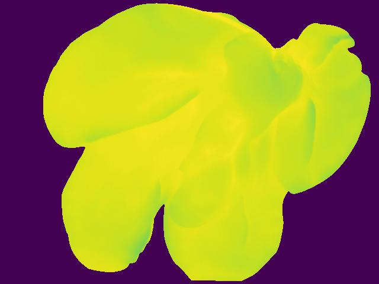

# CNN
Data:
We have infrared images of a pig liver taken at interval of 60 seconds for a period of 24 hours.
Size of data : 5800 images

Method:
CNN is used to build a classifier for the images. The quality of the liver is to be determined as good or bad. 
Tasks completed:
1. Tried building basic architecture ( unsuccessful)
2. Using transfer learning (current objective)(13-mar-2020)
3. Implemented hyperparameter tuning with hparams in tensorflow 

   

